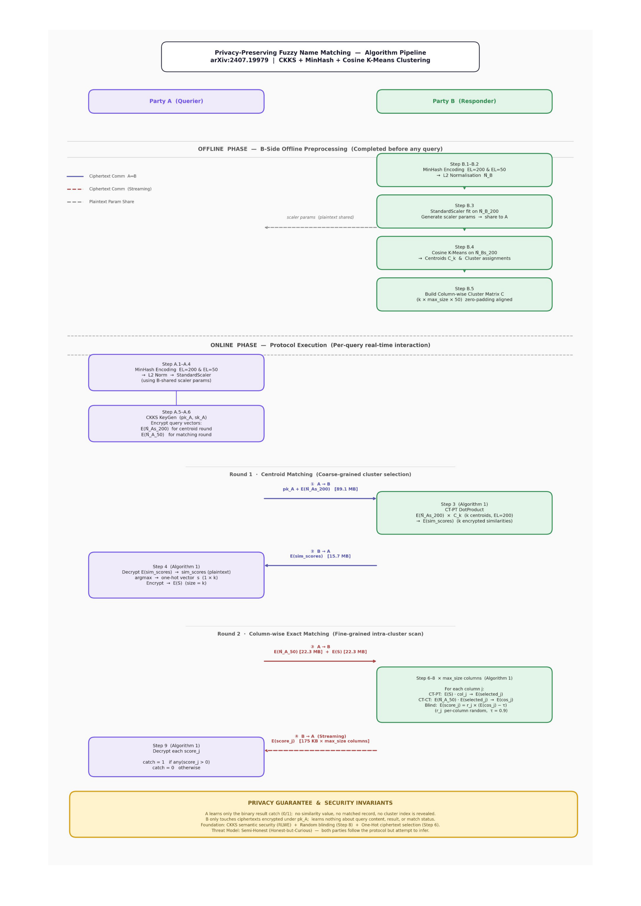

# Fuzzy Matching: 隐私保护下的模糊名称匹配

> 基于论文 *Privacy-preserving Fuzzy Name Matching for Sharing Financial Intelligence* 的基线方案实现与优化项目。

---

## 1. 项目概述

本项目参考该论文的基线方案，实现并优化一种基于 **CKKS 全同态加密 (FHE)** 与 **MinHash 签名** 的隐私保护模糊名称匹配方案。该方案允许查询方在不泄露自身查询内容的前提下，从响应方的密文数据集中检索潜在匹配项；同时响应方也不泄露任何数据信息。

核心创新点：**聚类增强** —— 响应方通过离线 K-Means 聚类将搜索空间从 $O(n)$ 降至 $O(\sqrt{n})$ 级别，在保持完美精度 (perfect precision) 的同时显著降低通信与计算开销。

### 关键指标

| 指标 | 目标 |
|------|------|
| 精度 (Precision) | 维持完美精度 (~100%) |
| 召回 (Recall) | 基线 ≥96%，优化阶段尽量减少聚类带来的召回损失 |
| 延迟 | 1000 条查询在 10k/100k/1M 数据量下的端到端耗时 |
| 通信开销 | 相比无聚类方案降低 30–300 倍 |
| 内存占用 | 单节点可承载的上限 |

---

## 2. 基线模型架构

### 核心流程

```
离线阶段 (B 侧)
  └── 对 B 的名称数据集生成 MinHash 签名 (3-gram, SHA-256, num_permutations)
  └── 归一化 + StandardScaler 标准化
  └── K-Means 聚类 (k ≈ √|N_B|, cosine similarity, 20 iterations)
  └── 填充至最大簇大小，生成簇矩阵 C 与质心 C_k

在线阶段
  A: 对查询名称生成 MinHash 签名 → 归一化 → 标准化
  A: 用 CKKS 公钥加密查询签名 E(N_As) → 发送给 B
  B: CompareToCentroids — 计算 E(N_As) 与各质心的点积 → 返回 E(sim_scores)
  A: 解密 sim_scores，生成 one-hot 指示向量 s (最匹配簇为 1，其余为 0)
  A: 加密 s 得到 E(S)，连同 E(N_A) 发送给 B
  B: ColumnWiseMatching — 对簇矩阵逐列操作：
      1) E(S) 与列向量做密文-明文点积 → 提取匹配簇中的名称
      2) 与 E(N_A) 做密文-密文点积 → 得到余弦相似度 E(cos_score)
      3) E(cos_score) - τ，乘以随机数 r → E(score)
  B: 逐列返回 E(score) 给 A
  A: 解密，若 score > 0 则判定为潜在匹配
```

### 系统架构图



### 关键参数

| 参数 | 说明 | 基线值 |
|------|------|--------|
| `shingle_size` | n-gram 粒度 | 3 |
| `num_permutations` | MinHash 签名长度 (聚类/匹配) | 200 / 50 |
| `max_hash` | 哈希值上限 | 20-bit |
| `k` | 聚类数 | ≈ √n |
| `tau` | 余弦相似度阈值 | 0.9 |
| `poly_modulus_degree` | CKKS 多项式模数 | 8192 |
| `coeff_mod` | 系数模数 | [60, 40, 40, 60] |
| `scale` | 缩放因子 | 2^40 |

---

## 3. 团队分工

| 模块 | 状态 |
|------|------|
| MinHash & 姓名编码 | ✅  |
| CKKS 全同态加密 | 🔄  |
| 加密余弦相似度 | 🔄  |
| 聚类优化 & 列矩阵 | 🔄  |
| 实验评估 & 消融 | 🔄  |

---

## 📚 参考

- 论文: *Privacy-preserving Fuzzy Name Matching for Sharing Financial Intelligence*
- 规范: `baseline/pipeline_spec.md`
- 接口: `baseline/项目分工与接口规范.pdf`

---

> **当前阶段**: Stage 1 — Baseline 复刻中
>
> **下一步**: 各成员按接口规范完成剩余模块，集成后进行端到端测试与指标验证。