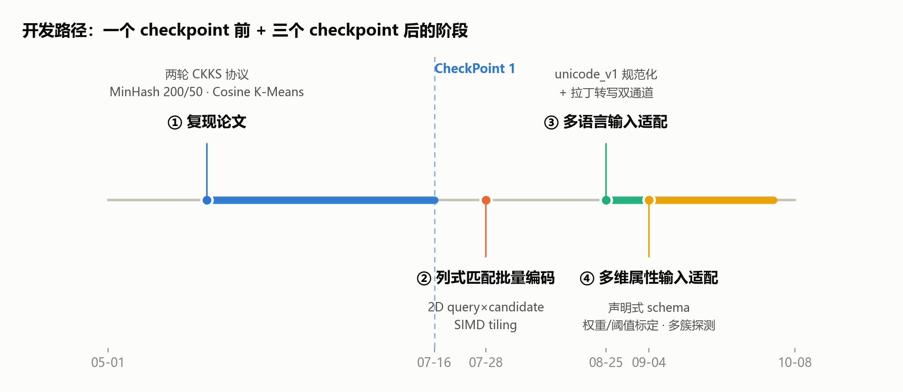
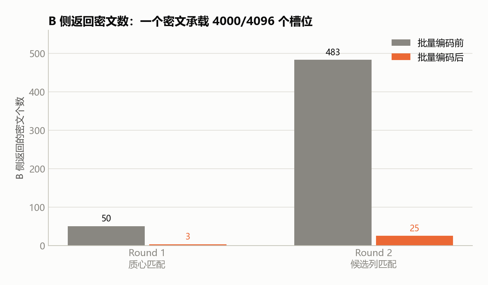
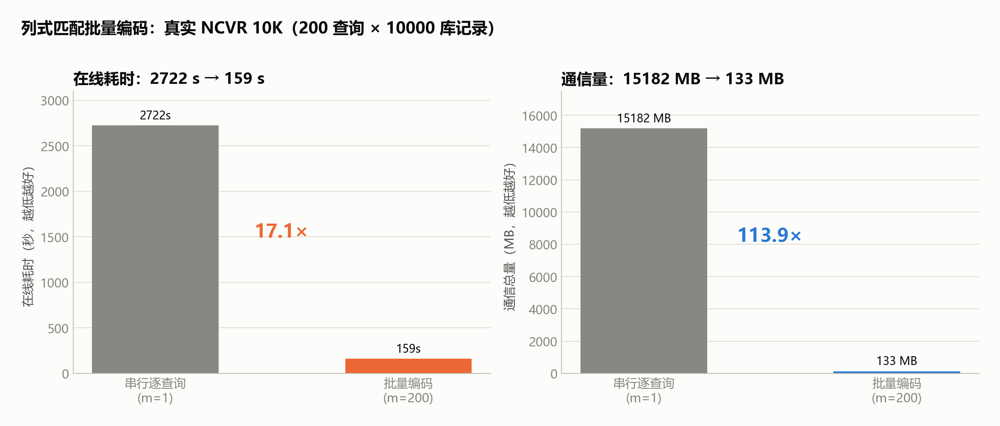
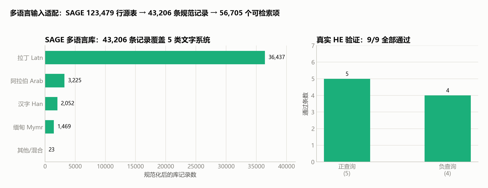
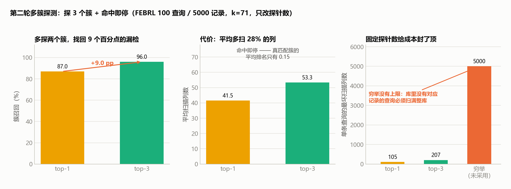
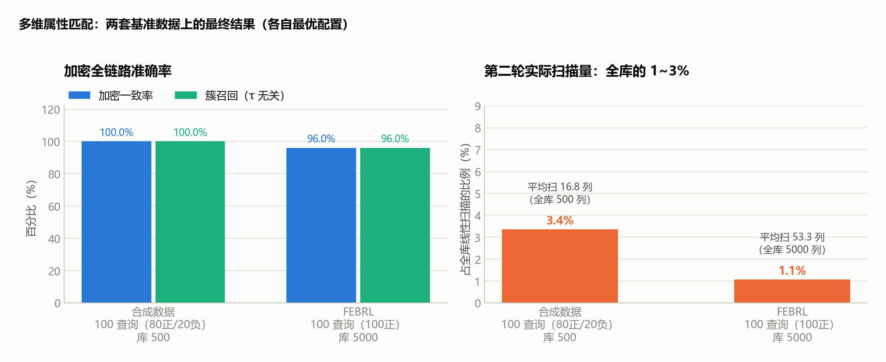

# Phrase Report

**范围**：初版（复现论文）→ CheckPoint 1 之后的三个增量阶段
**日期**：2026-10-08
**代码位置**：[baseline_Integration/](baseline_Integration/)
**运行环境**：Windows 11 + Python 3（venv）+ TenSEAL 0.3.16

---

## 0. 一页结论

| 阶段 | 做了什么 | 关键结果 |
|---|---|---|
| ① 复现论文 | 两轮 CKKS 协议：MinHash 200/50 + Cosine K-Means + 余弦阈值 | NCVR 10K 跑通；P=0.9804 / R=1.0 / F1=0.9901；**在线 2722 s、通信 15182 MB** |
| ② 列式匹配批量编码 | 二维 query×candidate SIMD tiling，一个密文装 4000/4096 槽 | 在线 **159 s（17.1×）**、通信 **133 MB（113.9×）**，精度分毫不变 |
| ③ 多语言输入适配 | unicode_v1 规范化 + 拉丁转写双通道建库 | SAGE 43,206 条记录 / 5 类文字系统；**验证查询 9/9 全通过** |
| ④ 多维属性输入适配 | 声明式 attribute schema；权重/阈值标定；多簇探测（top-3 + 命中即停） | 合成数据簇召回 **100%**，FEBRL数据集 簇召回 **96%**，成本只多 28% 的列且封顶 |

协议本身没有变——变的是**编码宽度、输入语言、输入字段**三件事，且每一件都用真实数据和真实 HE 链路量过。



---

## 1. 阶段①：复现论文（2026-05-24 ~ 2026-07-16）

### 关键实现

论文的协议骨架被完整落地为可运行模块：

```
Round 1  质心匹配：A 加密 200 维 MinHash 签名 → B 与 k 个质心做密文×明文点积
         → A 解密选簇 → 生成 one-hot selector 并加密
Round 2  列式匹配：A 发 50 维匹配向量 + 加密 selector → B 在密文上选列、
         做密文×密文点积、减去 mask×τ → A 解密，看分数正负判命中
```

- **聚类**：Cosine K-Means，质心 = 簇内均值向量的 L2 归一化，k=⌊$\sqrt{n}$⌋，与匹配阶段用的是同一个余弦语义。
- **编码**：200 维是聚类/选簇用的高分辨率签名，50 维是其**前 50 维前缀**，保证两个空间的语义对齐。
- **密码学边界**：3 次加密 / 2 次解密，同一组公私钥；B 侧只持有**去掉私钥的公开 context**，从代码层面无法解密任何中间结果。
- **隐私掩码**：B 对每个 `(query, candidate)` 对独立采样本轮正随机掩码 `r`，返回 `(cos − τ)·r`，A 只能读出正负号。

### 测试数据

NCVR 10K 子集：B 侧 10,000 条真实选民登记姓名，A 侧 200 条查询（100 正 / 100 负），τ=0.9，k=50。

### 测试结果

| 指标 | 数值 |
|---|---|
| Precision | 0.9804 |
| Recall | 1.0000 |
| F1 | 0.9901 |
| Accuracy | 0.9900 |
| 混淆矩阵 | TP=100 / FP=2 / FN=0 / TN=98 |
| 在线总耗时 | 2722.17 s（≈45.4 分钟） |
| 通信总量 | 15181.5 MB（≈14.8 GB） |

**结论**：协议正确性达标，零漏报；但性能不可接受——瓶颈不在密码学，而在**每个密文只用了 4096 个槽位里的几十个**。

---

## 2. 阶段②：列式匹配批量编码（2026-07-28）

### 关键实现

把批处理从"一次装多条查询"（V1 纵向）升级为**二维平铺**：

```
slot(q, t) = q × T + t        q ∈ [0, m)  批内第 q 条查询
                              t ∈ [0, T)  第 t 个候选项
T = ⌊4096 / m⌋                 m=200 时 T=20，active = 4000
```

一个密文同时承载 **200 条查询 × 20 个候选项 = 4000 个独立分数**，槽位利用率 4000/4096 = **97.7%**。

- Round 1：50 个质心切成 `⌈50/20⌉ = 3` 个 tile → B 只返回 **3 个密文**。
- Round 2：483 个候选列切成 `⌈483/20⌉ = 25` 个 tile → B 只返回 **25 个密文**。
- **安全性不变**：每个 `(query, candidate)` 对仍然采样独立掩码，padding 槽置零且 mask=1，判定逻辑与串行版逐位一致。
- 传输边界强制 **bytes 序列化**：A 侧加密 → `serialize()` → B 侧用公开 context 反序列化，B 无法解密中间结果。



### 测试数据

与阶段①同一份 NCVR 10K（200 查询 × 10000 库记录，关闭 early-stop 跑满 483 列），仅切换 `--batch-size 200`。

### 测试结果



| 指标 | 串行逐查询 | 批量编码 m=200 | 变化 |
|---|---|---|---|
| 在线总耗时 | 2722.17 s | **159.49 s** | **17.1×** |
| 通信总量 | 15181.5 MB | **133.28 MB** | **113.9×** |
| 每查询通信 | 75.9 MB | **682 KB** | 114× |
| 峰值内存 | 73.3 MB | 73.3 MB | 持平 |
| P / R / F1 / Acc | 0.9804 / 1.0 / 0.9901 / 0.99 | **完全相同** | 无退化 |

数值精度：全链路最大绝对误差 **9.57e-05**，p99 误差 3.61e-05，**每个 score 的正负判定与明文参考一致率 100%**。

> 注：另一次同配置运行记录为在线 144.42 s（≈18.7×），本表采用仓库内 `artifacts/evaluation/ncvr_10k_batch200/ncvr_10k_result.json` 的实测值，差异来自机器负载波动。

**结论**：用 SIMD 槽位换掉重复的序列化与同态运算，**在线快 17 倍、通信省 114 倍，而精度一个小数位都没动**。

---

## 3. 阶段③：多语言输入适配（2026-08-25 ~ 2026-09-03）

### 关键实现

原实现的正则 `[^a-z\s]` 会把汉字、阿拉伯文、重音字符**整段删掉**，非拉丁姓名进来就是空签名。改为三级流水线：

1. **`english_v1`（原路径不动）**：NCVR 等英文数据继续走老规则，保证零回归。
2. **`unicode_v1`（新路径）**：Unicode NFKC 规范化 → 跨文字大小写折叠 → 标点清理 → 拉丁重音折叠（é→e）→ **保留原生文字**（阿拉伯、汉字、缅甸文等都留着，不再压成空签名）。
3. **拉丁转写双通道**：用固定版本 `anyascii==0.3.3` 生成 `latin_transliterated` 变体，与原生姓名**一起**加入 B 侧建库；A 侧查询同样展开变体，于是"廖學廣"和"LiaoXueGuang"落在同一套 MinHash + 聚类 + HE 协议里。

关键是**做在数据适配层，没动 HE 协议**——`data_pipeline/` 的 adapter/normalizer 边界吸收全部多语言差异，`party_a/`、`party_b/` 一行没改。



### 测试数据

| 数据集 | 规模 | 说明 |
|---|---|---|
| SAGE 源表 | 123,479 行 / 23 个国家 | 只有 `candidate_name, country` 两列 |
| 规范化后库记录 | **43,206 条** | 去重 + unicode_v1 之后的库规模 |
| 可检索项 | **56,705 个** | 加入拉丁转写变体后实际建库的条目数 |
| 验证查询 | 9 条（5 正 / 4 负） | 跨拉丁、阿拉伯、汉字、汉字+拉丁、缅甸五种情形 |

### 测试结果

**真实 HE 链路验证：9/9 全部通过（`all_passed = true`）。**

| 查询 | 文字系统 | 标签 | 结果 |
|---|---|---|---|
| `hu-accent-fold`（匈牙利语重音折叠） | Latn | 正 | ✅ |
| `ar-romanized`（阿拉伯原名 ↔ 拉丁转写） | Latn | 正 | ✅ |
| `zh-romanized`（`LiaoXueGuang` ↔ `廖學廣`） | Latn | 正 | ✅ |
| `my-width-normalization`（缅甸文全角括号） | Mymr | 正 | ✅ |
| `zh-latin-mixed`（`瓦歷斯貝林 WalisPerin`） | Han+Latn | 正 | ✅ |
| `negative-latin` / `negative-arabic` / `negative-han` / `negative-myanmar` | 四种 | 负 | ✅ 全部正确拒识 |

**结论**：协议从"只认英文小写字母"扩展到**五类文字系统**，跨文字转写匹配（汉字↔拼音、阿拉伯↔拉丁）真实跑通，且英文路径零回归。

---

## 4. 阶段④：多维属性输入适配（2026-09-04 ~ 2026-10-03）

### 关键实现

姓名不是唯一标识——同名不同人靠姓名分不开。V2 把硬编码的"姓名 + 生日"原型泛化为**声明式 schema**：

```
S = Σ wᵢ · simᵢ(attributeᵢ)
```

每个属性块先 L2 归一化、再乘 `sqrt(wᵢ)`、然后拼接；因为块之间不重叠，CKKS 的一次点积**恰好等于**上面的加权和。**两轮协议结构完全没变**，变的只是向量宽度和装配方式。

- **内置 kind**：`fuzzy_text`（姓名/地址，MinHash）、`exact`（电话/SSN/邮编，分块哈希）、`date`（日期，含 `day_first` / `on_invalid` 策略）。`registry.register_encoder` 是扩展点，声明维度与实际编码不一致会直接报错，而不是悄悄错位。
- **权重与阈值改为实测反推**：`calibrate_multi_attribute.py` 在**组合分**上做坐标上升，最大化"真匹配赢过自己最强冒充者"的概率。产出的 JSON 是可直接复用的 job 文件。
- **多簇探测**：第二轮从"只看一个簇"改为按质心分降序探测 3 个簇、命中即停（`DEFAULT_MULTI_ATTRIBUTE_PROBES = 3`）。**只对多维属性输入开启**；姓名单属性路径（`party_a/party_b`）仍是纯 `argmax` 的 top-1，没有探测逻辑。
- **k 策略**：`auto = ⌊1.4·√n⌋`，从实测代价曲线选出。


多簇探测的收益（FEBRL 100 查询 / 5000 记录 / k=71 / 标定后 τ=0.513，**同一条加密链路，只改 `--probes`**）：



| 探针数 | 簇召回 | 加密一致率 | 平均扫描列数 | 最坏单条扫描列数 |
|---|---|---|---|---|
| top-1 | 87.0% | 87.0% | 41.5 | 105 |
| **top-3（默认）** | **96.0%** | **96.0%** | **53.3** | **207** |
| 穷举（未采用） | 100% | — | — | **5000（= 整库）** |

多探两个簇，用**平均多扫 28% 的列**换回 9 个百分点的漏检。代价之所以这么小，是因为探测按质心分降序、命中即停，真匹配簇的平均排名只有 0.15 —— 绝大多数查询在第一、二个簇就停了。


### 测试数据与结果
#### 数据构成

**FEBRL（真实数据）**

| 属性 | kind | 权重 | 匹配维度 | 取自 |
|---|---|---|---|---|
| name | fuzzy_text | 0.273 | 50 | given_name + surname |
| address | fuzzy_text | 0.204 | 30 | street_number + address_1 + address_2 |
| ssn | exact | 0.199 | 1024 | soc_sec_id |
| dob | date | 0.179 | 256 | date_of_birth |
| postcode | exact | 0.116 | 512 | postcode |
| state | exact | 0.029 | 64 | state |
| **合计** | | **1.000** | **1936** | |

规模：库 `dataset4a` 5000 条原始记录；查询 `dataset4b` 前 100 条**损坏模糊副本**，每条都对应库中一条 —— 100 正 / 0 负。这是 FEBRL 标准的"重复记录检测"用法：查询是库记录的损坏版本，坏在哪些字段由生成器随机决定，正是这套多属性方案要对付的场景。

**合成数据（`generate_synthetic_attributes.py`）**

| 属性 | kind | 权重 | 匹配维度 |
|---|---|---|---|
| name | fuzzy_text | 0.30 | 50 |
| dob | date | 0.20 | 256 |
| phone | exact | 0.20 | 256 |
| address | fuzzy_text | 0.15 | 30 |
| email | exact | 0.10 | 256 |
| gender | exact | 0.05 | 8 |
| **合计** | | **1.000** | **856** |

规模：库 500 条，查询前 100 条（80 正 / 20 负 —— 有负例，才能量误报）。刻意带上 phone / email / gender：电话号码在公开数据集里拿不到，只能合成，而 `normalize="digits"` 能让 `+1 (555) 010-0199` 和 `15550100199` 落进同一个桶。

#### 测试结果

两行都是**完整两轮 CKKS 协议**的落盘结果（真实 TenSEAL，非明文代跑），探测数都是 top-3：

- **FEBRL** 的权重与阈值来自 `calibrate_multi_attribute.py` 实测标定（τ=0.513）。
- **合成数据** 用的是其配置自带的权重与 τ=0.6。这个值不是拍的：配置文件注明它落在生成器 5000 条实测的标定区间 (0.501, 0.841) 内（下限 = 最高冒充者分，上限 = 最低真匹配分）。



| 数据 | 规模 | 阈值 | 明文 top-1 召回 | 加密一致率 | 簇召回 | 误报 |
|---|---|---|---|---|---|---|
| 合成数据 | 100 查询（80正/20负），库 500 | 0.6 | 100% | **100%** | **100%** | **0%** |
| FEBRL | 100 查询（100正），库 5000 | 0.513（实测标定） | 100% | **96.0%** | **96.0%** | — |

第二轮的实际代价：

| 数据 | 平均扫描列数 | 全库线性扫描 | 占比 |
|---|---|---|---|
| 合成数据 | 16.8 | 500 | 3.4% |
| FEBRL | 53.3 | 5000 | 1.1% |

合成数据那 16.8 列内部并不均匀：**正查询平均只扫 3.9 列**（命中即停），**负查询平均扫 68.7 列**（撞不到命中列，只能把 3 个簇走完）。这正是固定 top-3 的意义 —— 负查询的成本有上限，不会随数据库长大而线性爆炸。


FEBRL 剩下的 4 条漏检（96/100）归因全部是**第一轮选错簇**（`misses_round1_cluster=4`，边界 0、无法解释 0）：真匹配根本不在被检查的簇里，**调阈值和调权重一条都够不着**。这是信息问题——FEBRL 生成器把某些副本的字段损坏到真匹配分贴近冒充者——要靠加属性或提升字段质量解决，不是继续调参。


---

## 5. 回归与工程质量

- **测试**：`python -m pytest tests -q` → **281 passed / 0 failed（439.93 s）**，全绿。阶段②结束时为 133 passed，此后新增的多语言、多维属性、探测策略等专项测试把用例数翻了一倍。
- **安全边界靠代码而非约定**：`FirstRoundRequest` 结构上就装不下 `encrypted_query_50`；B 侧函数签名里不存在 `secret_context`；`test_security_boundary.py` 自动验证这些边界。
- **可复现**：所有指标脚本都落盘 JSON + CSV + PNG；权重与阈值是标定产物而非手写常量，标定一次即可复现整轮评测。

---

## 6. 当前边界与下一步

**已实现**：真实 TenSEAL CKKS 全链路（非 mock）、二维 SIMD batching、五类文字系统输入、声明式多维属性 schema、实测标定的权重/阈值、多簇探测。

**已知边界**：

1. **第二轮 B 侧核仍是 Python 层循环**——每个 tile 内还是 `k×d` 次乘加。下沉到 TenSEAL C++ tensor API 后仍有显著余量（这是目前最大的单点优化空间）。
2. **early stop 只对"命得中"的查询成立**——库里没有对应记录的查询撞不到命中列，停不下来。当前靠固定 top-3 给成本封顶（最多 3 个簇的列数），不再退化成整库扫描；代价是簇召回从穷举的 1.0000 让到 96%。
3. **转写是上下文无关的字符级映射**，不是语言学姓名模型；多音字、姓名顺序、阿拉伯元音补全仍会产生不一致。
4. **FEBRL 的交错带与漏检都是信息问题不是调参问题**——最弱真匹配 0.5132 低于最高冒充者 0.5982，没有全局 τ 能两全；top-3 下剩下的 4 条漏检仍全是第一轮选错簇。要靠加属性或提升字段质量解决。
5. **协议只回传"是否 catch / 簇号 / 列号"**，从不回传命中记录的 id——所以上面所有数字是**检出率**，不是识别准确率。

**建议优先级**：

1. 第二轮核下沉 C++/TenSEAL tensor API，保持每对独立掩码语义不变。
2. 扩到完整 NCVR 与更强模糊查询集（typo、缩写、nickname）。
3. 把可配置的语言专用 transliterator 接到现有 variant 注册边界，**不改 HE 协议**。


