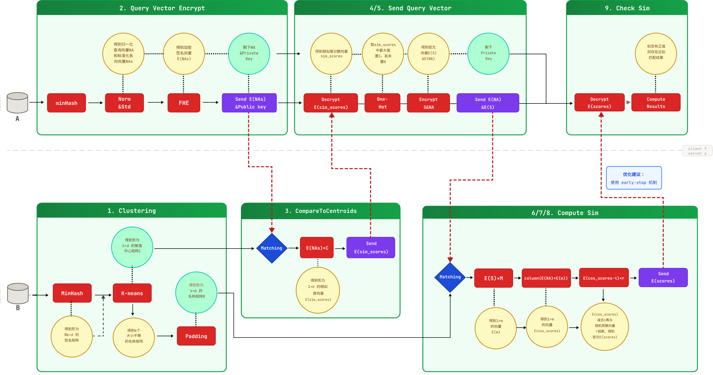

# 五人分工接口规范 人类版

> 本文档用于团队协作时快速对齐。它只说明每个人在系统中的位置、要完成的任务、从谁那里接收数据、向谁交付结果。

---

## 总体分工

这次按五个人拆分：

| 成员  | 负责内容    | 一句话说明                         |
| --- | ------- | ----------------------------- |
| 成员一 | 1 和 3   | 负责 B 侧建库，并完成第一轮质心匹配           |
| 成员二 | 2       | 负责 A 侧把查询姓名变成加密查询             |
| 成员三 | 4 和 5   | 负责 A 侧选择最可能的 cluster，并发起第二轮请求 |
| 成员四 | 6、7、8、9 | 负责 B 侧列式匹配，并完成 A 侧最终判断        |
| 成员五 | 测试      | 负责证明各模块能单独工作，也能串起来跑通          |

---

## 成员一：B 侧建库与质心匹配

成员一负责系统的 B 侧基础能力。第一部分是在离线阶段处理 B 的姓名数据库，把所有姓名转成 MinHash 向量，完成归一化、标准化和聚类，并构建后续列式匹配要用的名称矩阵。

这里的聚类必须按余弦相似度完成，质心更新后要重新归一化。不能直接把普通欧氏 K-Means 的结果当成最终聚类结果。

如果聚类过程中出现空 cluster，不能产生无效质心。默认做法是保留上一轮质心，必要时用当前误差最大的样本重置。

成员一还负责第一轮在线计算。A 发来加密后的查询向量后，成员一用它和 B 本地保存的聚类质心做密文计算，返回加密后的相似度结果。

成员一从上游获取 B 的原始姓名列表和全局配置参数。离线阶段完成后，要向成员二提供标准化参数，让 A 侧查询进入同一个向量空间；同时要把聚类质心留给第一轮匹配，把列式名称矩阵交给成员四。

成员一向下游提供三类结果：给成员二的标准化参数，给自己在线匹配使用的聚类质心，给成员四使用的列式名称矩阵。

---

## 成员二：A 侧查询加密

成员二负责把 A 的查询姓名变成可以发给 B 的加密查询。这个模块先使用和 B 一致的 MinHash 规则生成两种长度的查询向量，再用成员一提供的标准化参数处理用于聚类匹配的查询向量，最后用 TenSEAL 完成加密。

成员二从成员一获取标准化参数，从查询方获取待查询姓名。成员二不能自己重新拟合标准化器，因为 A 的查询必须进入 B 的标准化空间。

成员二向成员一提供第一轮要用的加密查询向量和公开加密上下文。成员二还要保留第二轮会用到的加密查询向量，并把它交给成员三继续发送。私钥只留在 A 侧，不能交给 B 侧模块。

当前基线只做单条查询。用于最终匹配的短向量只做归一化，不做标准化；它必须来自长向量的前 50 维，不能重新生成一套不一致的签名。

第一轮发给 B 的内容只包含公开加密上下文和长查询密文。短查询密文先留在 A 侧，等成员三完成 cluster 选择后，才进入第二轮请求。

---

## 成员三：A 侧 cluster 选择与第二轮发送

成员三负责 A 在第一轮返回后做出的选择。成员一返回的是加密相似度，成员三在 A 侧解密这些结果，找出最可能包含匹配姓名的 cluster，并把这个选择变成 one-hot 向量后再次加密。

成员三从成员一接收加密的质心相似度结果，从成员二接收 A 侧私钥上下文和第二轮查询密文。成员三只负责选择 cluster 和组织第二轮请求，不负责 B 侧列式匹配。

成员三向成员四提供两个密文：一个是加密后的查询向量，另一个是加密后的 cluster 选择向量。成员四只能用这两个密文继续计算，不能知道 A 实际选择了哪个 cluster。

实际选中的 cluster 只能留在 A 侧调试和测试记录里，不能放进发给 B 侧的请求对象。

---

## 成员四：列式匹配与最终判断

成员四负责协议的核心匹配阶段。B 侧拿到成员三发来的两个密文后，使用成员一构建好的列式名称矩阵逐列计算。每一列都会先在密文中选出目标 cluster 对应的候选姓名，再和 A 的查询向量计算加密相似度，最后减去阈值并乘随机数，让 A 只能判断正负，不能看到真实相似度。

成员四从成员一接收列式名称矩阵，从成员三接收加密查询向量和加密选择向量。B 侧只做密文计算，不解密，不知道 A 查询了什么，也不知道 A 选择了哪个 cluster。

成员四最后还负责 A 侧判断。A 收到 B 返回的加密分数后逐个解密，只要发现正分数，就说明存在潜在匹配，可以提前停止。最终输出只有是否匹配。

最终判断要考虑 CKKS 近似误差，不直接卡在零点。对外只说是否超过阈值，不输出第一次命中的列位置。

成员四虽然负责 B 侧计算和 A 侧判断，但代码必须隔离。B 侧文件不能接收私钥上下文，A 侧文件不能接收 B 的列式名称矩阵。

B 侧用于混淆分数的随机数必须是有上限的正数，避免把 CKKS 的微小误差放大成误报。

---

## 成员五：测试与评估

成员五负责让整个协作结果可验证。测试要覆盖每个成员的独立模块，也要覆盖完整协议链路。重点不是写更多业务逻辑，而是确认所有接口能对上，数据形状正确，A 和 B 的安全边界没有被破坏。

成员五从前四位成员获取公开接口、离线产物和协议输出。成员五需要验证 MinHash 是否一致，标准化参数是否正确复用，聚类矩阵是否补齐正确，密文点积解密后是否接近明文结果，端到端流程是否能得到正确的匹配判断。

成员五向团队提供测试结果、通信开销统计、准确率和召回率等评估结果。当前阶段最重要的是先让小规模端到端流程稳定跑通，再扩展到更大的数据规模和性能评估。

测试还要覆盖两个安全边界：公开加密上下文不能包含私钥，发给 B 的第二轮请求不能包含实际选中的 cluster。

测试还要确认第一轮请求不会提前包含短查询密文，随机 mask 不改变分数符号，empty cluster 不会生成无效质心。

---

## 全链路交接关系

成员一先完成 B 侧离线建库，产出标准化参数、聚类质心和列式名称矩阵。成员二拿标准化参数处理 A 的查询，并生成第一轮和第二轮会用到的密文。成员一用第一轮密文完成质心匹配，把加密结果交回 A 侧。成员三解密后选择 cluster，并把第二轮密文交给成员四。成员四完成列式匹配并输出最终是否命中。成员五贯穿全流程，确保每个交接点都能被测试验证。

这条线的核心边界是：A 只暴露密文查询和公开加密上下文，B 只暴露标准化参数和密文计算结果。A 不泄露查询内容，B 不泄露数据库内容，最终 A 只知道是否存在潜在匹配。
