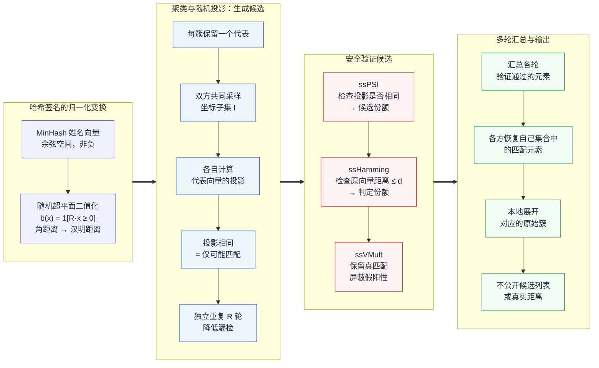
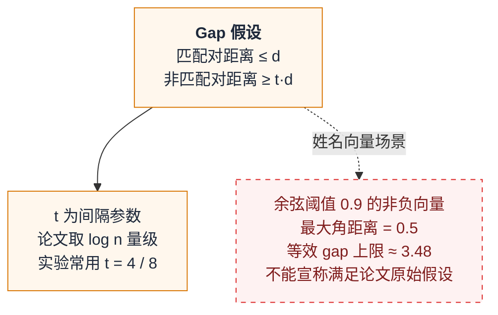

# Approx-PSI 流程图

对应 slide "04 探索新径"，修正点：补上被跳过的**二值化嵌入层**，并把 gap 假设写成参数化形式。

## 版本 A：完整流程

```mermaid
flowchart LR
    subgraph S0["哈希签名的归一化变换"]
        V["MinHash 姓名向量<br/>余弦空间，非负"] --> BIN["随机超平面二值化<br/>b(x) = 1[R·x ≥ 0]<br/>角距离 → 汉明距离"]
    end

    subgraph S1["聚类与随机投影：生成候选"]
        C1["每簇保留一个代表"] --> C2["双方共同采样<br/>坐标子集 I"]
        C2 --> C3["各自计算<br/>代表向量的投影"]
        C3 --> C4["投影相同<br/>= 仅可能匹配"]
        C4 --> C5["独立重复 R 轮<br/>降低漏检"]
    end

    subgraph S2["安全验证候选"]
        P["ssPSI<br/>检查投影是否相同<br/>→ 候选份额"] --> H["ssHamming<br/>检查原向量距离 ≤ d<br/>→ 判定份额"]
        H --> M["ssVMult<br/>保留真匹配<br/>屏蔽假阳性"]
    end

    subgraph S3["多轮汇总与输出"]
        O1["汇总各轮<br/>验证通过的元素"] --> O2["各方恢复自己集合中<br/>的匹配元素"]
        O2 --> O3["本地展开<br/>对应的原始簇"]
        O3 --> O4["不公开候选列表<br/>或真实距离"]
    end

    S0 ==> S1 ==> S2 ==> S3

    classDef embed fill:#EEF2FF,stroke:#4F46E5,color:#1e293b
    classDef cand fill:#EFF6FF,stroke:#2563EB,color:#1e293b
    classDef verify fill:#FEF2F2,stroke:#DC2626,color:#1e293b
    classDef output fill:#F0FDF4,stroke:#16A34A,color:#1e293b
    classDef caveat fill:#FFF7ED,stroke:#EA580C,color:#7c2d12,stroke-dasharray: 5 5
    class V,BIN embed
    class C1,C2,C3,C4,C5 cand
    class P,H,M verify
    class O1,O2,O3,O4 output
    class NOTE0 caveat
```

## 版本 B：gap 假设的正确写法

```mermaid
flowchart TD
    GAP["<b>Gap 假设</b><br/>匹配对距离 ≤ d<br/>非匹配对距离 ≥ t·d"] --> PARAM["t 为间隔参数<br/>论文取 log n 量级<br/>实验常用 t = 4 / 8"]
    GAP -.->|姓名向量场景| WARN["余弦阈值 0.9 的非负向量<br/>最大角距离 = 0.5<br/>等效 gap 上限 ≈ 3.48<br/>不能宣称满足论文原始假设"]
    classDef gapbox fill:#FFF7ED,stroke:#D97706,color:#1e293b
    classDef warn fill:#FEF2F2,stroke:#DC2626,color:#7f1d1d,stroke-dasharray: 5 5
    class GAP,PARAM gapbox
    class WARN warn
```

